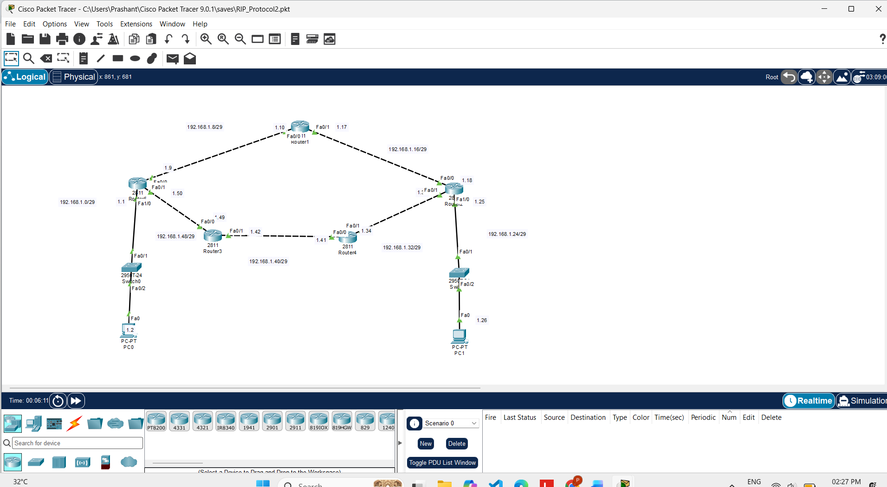
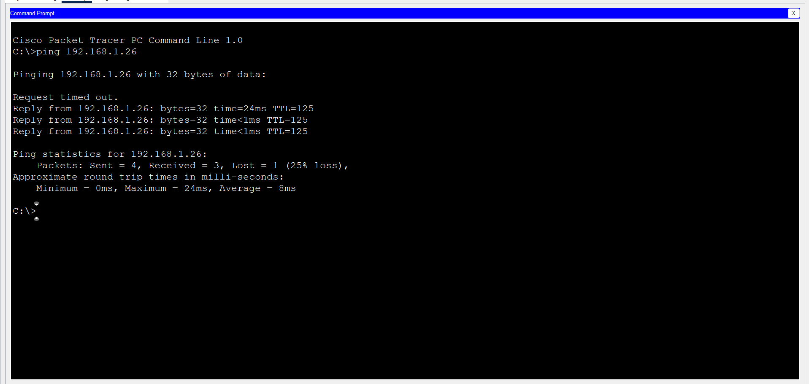

# RIP Lab

## Objective
Configure RIPv2 dynamic routing between 5 routers in Cisco Packet Tracer so that PC0 and PC1 can communicate.

## Topology


## Network Details

| Network | Connected Devices |
|---------|-------------------|
| 192.168.1.0/29 | Router5 - Switch0 - PC0 |
| 192.168.1.8/29 | Router5 - Router1 |
| 192.168.1.16/29 | Router1 - Router2 |
| 192.168.1.24/29 | Router2 - Switch - PC1 |
| 192.168.1.32/29 | Router2 - Router4 |
| 192.168.1.40/29 | Router4 - Router3 |
| 192.168.1.48/29 | Router3 - Router5 |

## Commands Used

Run on every router:

```
Router> enable
Router# configure terminal
Router(config)# router rip
Router(config-router)# version 2
Router(config-router)# no auto-summary
Router(config-router)# network 192.168.1.0
Router(config-router)# end
Router# write memory
```

## Command Explanation

| Command | Purpose |
|---------|---------|
| `router rip` | Starts the RIP routing process |
| `version 2` | Uses RIPv2 (supports subnet masks) |
| `network 192.168.1.0` | Enables RIP on all interfaces in this network |

## Verification

```
Router# show ip route
Router# show ip protocols
Router# show ip route rip
PC0> ping 192.168.1.26
```

## Result
Routes learned via RIP are shown with `R` in the routing table, and the ping from PC0 (192.168.1.2) to PC1 (192.168.1.26) is successful.

### Ping Result


## Packet Tracer File
[Download RIP_Protocol2.pkt](RIP_Protocol2.pkt)


